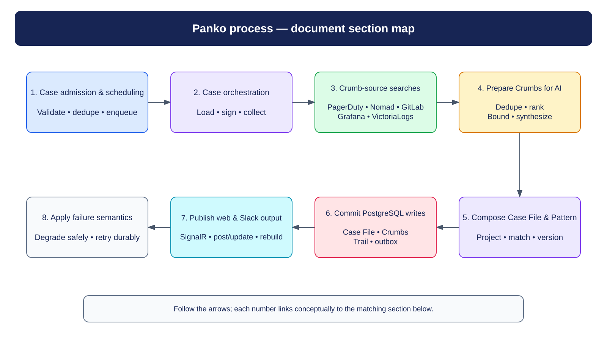
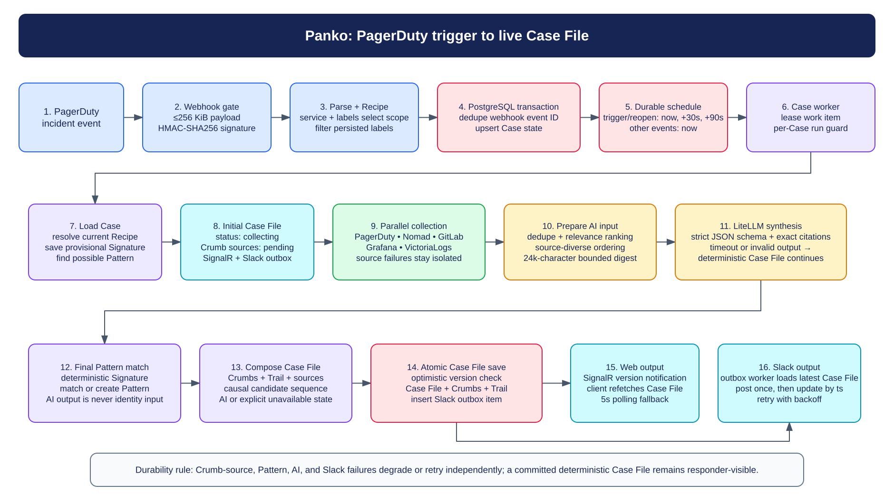
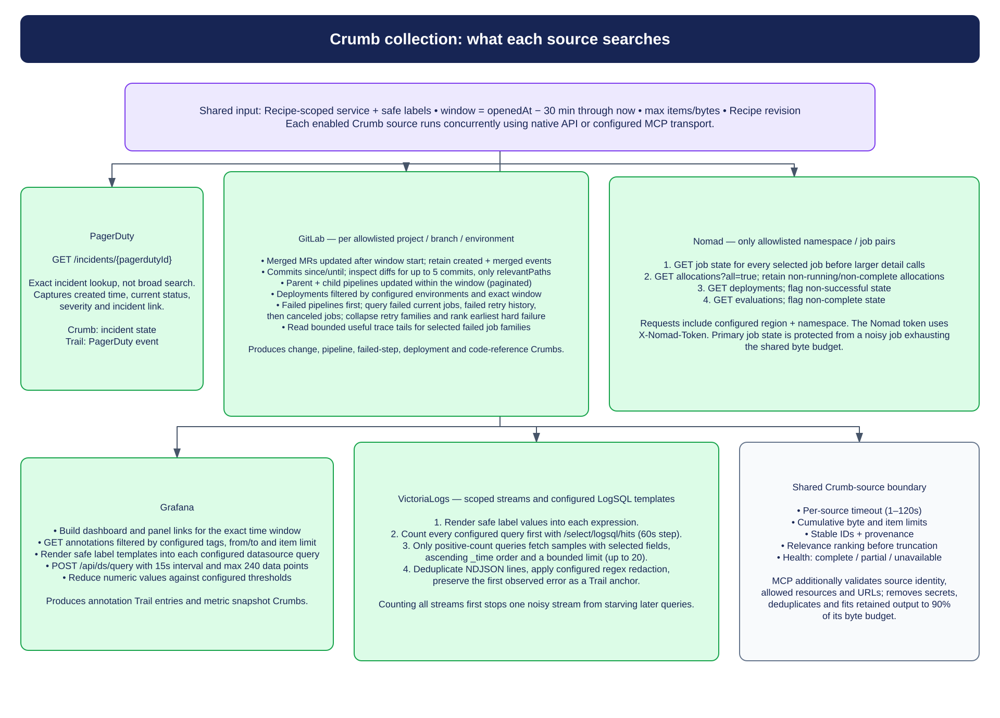
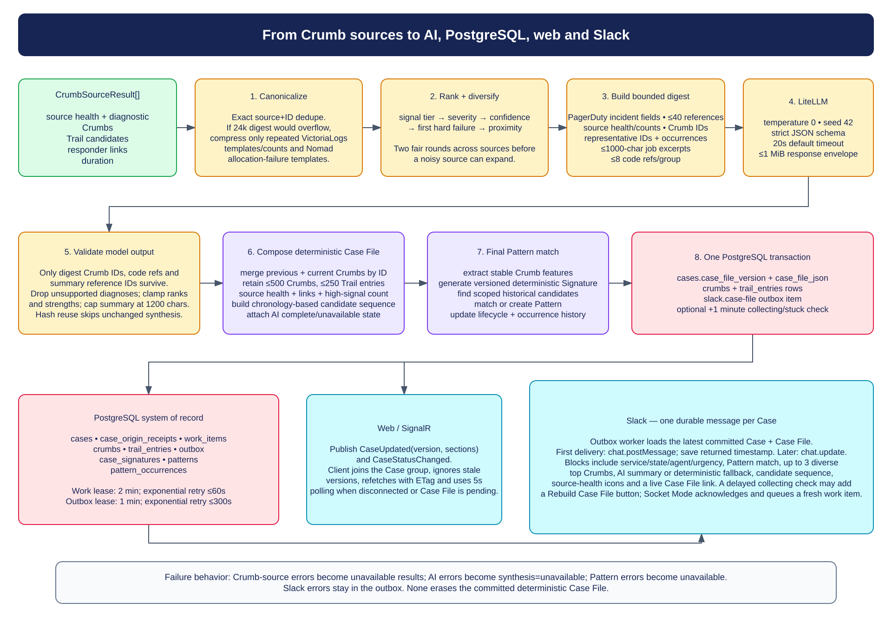

# Panko Case flow

This document describes the production path from an accepted PagerDuty event to the live web Case File, Slack message, and PostgreSQL records. It reflects the current implementation in `Panko.Api`; demo mode is an in-memory fixture adapter that mirrors the same initial Case File, lightweight progress, and final Case File publication shape without PostgreSQL or external Crumb sources.

The concrete projects, jobs, dashboards, log queries, and labels are supplied by Recipe YAML. Crumb-source endpoints, credentials, API/MCP selection, timeouts, and source limits come from application configuration. The source descriptions below document the search shape and enforcement boundaries rather than environment-specific targets.

## Section map



Editable source: [`panko-numbered-process.excalidraw`](diagrams/panko-numbered-process.excalidraw)

## Detailed end-to-end overview



Editable source: [`panko-trigger-to-output.excalidraw`](diagrams/panko-trigger-to-output.excalidraw)

The important durability seam is the first PostgreSQL transaction. It records the webhook receipt, upserts the Case, and creates durable work before the endpoint returns `202 Accepted`. Everything after that can be retried or degraded independently.

## 1. Case admission and durable scheduling

PagerDuty sends `POST /api/webhooks/pagerduty/v3`.

1. The endpoint rejects a declared or streamed body larger than the configured maximum. The checked-in default is 256 KiB.
2. It verifies the `X-PagerDuty-Signature` as HMAC-SHA256 using a secret from the configured environment variable. The comparison is fixed-time.
3. It parses the event ID and type, incident ID, service ID, title, urgency, URL, occurrence time, alert-rule ID, and short string custom details.
4. The Recipe store selects a Recipe by PagerDuty service ID, then by the most-specific matching alert-rule/label selector. It persists only standard or selector-used labels and rejects label names that look sensitive.
5. `AcceptWebhookAsync` starts a PostgreSQL transaction:
   - inserts `case_origin_receipts(idempotency_key, payload_hash, …)` with `ON CONFLICT DO NOTHING`;
   - treats an existing event ID as a duplicate and creates no new work;
   - upserts the `cases` row by PagerDuty incident ID;
   - maps the PagerDuty event to responder state and freezes resolved Cases;
   - inserts idempotent `work_items`.
6. Triggered and reopened events schedule Case passes for now, +30 seconds, and +90 seconds. Acknowledged, escalated, reassigned, resolved, and unknown events schedule one immediate pass.

Those repeated triggered/reopened passes intentionally sample a developing PagerDuty incident. Each Case File pass merges with retained Crumbs from the previous version, and unchanged Crumbs can reuse the previous successful AI synthesis by content hash.

The Case worker leases due work for two minutes, increments its attempt count, and prevents two runs for the same Case from executing at once. Failed work is released with exponential retry capped at 60 seconds.

## 2. Case orchestration

For each leased work item, the Case builder:

1. Loads the current Case and resolves the current Recipe.
2. Generates and persists a provisional deterministic Signature from the Case and safe labels, then looks for possible historical Pattern matches.
3. Saves the initial `collecting` Case File once for a new Case. Later passes keep the previous canonical Case File intact and publish status/progress metadata instead of rewriting its Crumbs.
4. Sets the persisted Case status to `collecting`.
5. Builds the Case context and selected source set, starts a progress attempt scoped to the Case File version, then asks the adaptive Crumb collector for a bounded result set.
6. Starts with the configured Crumb window, runs the Recipe-enabled Crumb sources concurrently, and doubles the lookback while accumulated Crumbs remain deterministically inconclusive.
7. Fixes the initial collection end time, then queries only disjoint older rings as the window expands: 0–30 minutes, 30–60, 60–120, and 120–240 with the checked-in defaults. For a resolved PagerDuty incident, that end is `min(now, resolvedAt + CrumbPostResolutionWindowMinutes)`; current-cycle acknowledgement and resolution times are stored separately from Case File update times. PagerDuty, Nomad, and Consul are exact/current snapshots, so they run only in the first pass; GitLab, Grafana, Kafka, and VictoriaLogs query each older ring.
8. Converts a Crumb-source exception into an `unavailable` result without cancelling the other sources. If a wider call fails, useful Crumbs retained from a narrower call remain available and the source is marked partial.
9. Persists lightweight progress after each pass start, Crumb-source completion, and pass completion. This projection contains source state/health, cumulative durations and counts, the current lookback, and at most five bounded early Crumbs—never canonical Crumb payloads.
10. Composes the deterministic result in memory as soon as collection finishes, resolves the final Pattern context, marks the deterministic Case File usable while AI synthesis runs, then commits one canonical Case File version and publishes it through SignalR.

The deterministic clarity policy does not stop for one generic high-signal Crumb. It stops for a structured explicit failure, high-signal Crumbs from distinct sources within ten minutes of each other, or a scoped change that precedes a recent failure Crumb from another source. Metric timing uses the reducer's real sample timestamp and breach interval; an untimestamped scalar metric cannot corroborate another source or establish change ordering. If none appears, the collection outcome explicitly records that the maximum window was reached or that no selected Crumb source supports expansion. Each Crumb-source call still has ceilings of 250 items and 1 MiB by default, and the merged retained result for each source is capped again across all rings. Each Crumb source also applies the stricter of those limits and its application-configured item/byte limits. Structured pass logs record the queried ring, duration, returned/new/duplicate Crumb counts, source health counts, clarity reason, final completion reason, and supporting Crumb IDs. `CrumbMaximumWindowMinutes` must be at least `CrumbWindowMinutes`.

## 3. What each Crumb source searches



Editable source: [`panko-source-searches.excalidraw`](diagrams/panko-source-searches.excalidraw)

| Source | Native API search | Crumbs produced |
| --- | --- | --- |
| PagerDuty | Looks up exactly `GET /incidents/{pagerdutyIncidentId}`. It does not perform a broad incident search. | Current incident status, creation time, severity, incident link, and a PagerDuty Trail entry. |
| Nomad | For each allowlisted namespace/job pair, reads the primary job state first, then allocations with `all=true`, deployments, and evaluations. Region and namespace are explicit. Allocations in `running` or `complete` state are omitted; unhealthy job/deployment/evaluation states become workload-failure Crumbs. | Job state, unhealthy allocations, deployments/evaluations, workload Trail entries, and job links. |
| Consul | For each expected allowlisted service, calls `GET /v1/health/service/{service}` with the configured datacenter, namespace, and partition. It deliberately does not pass `passing=true`, so unhealthy registrations remain visible and an empty array proves the expected service is unregistered. It never enumerates the global catalog. | A stable registered/unregistered service snapshot, passing/warning/critical/unknown instance counts, unhealthy-instance Crumbs, and scoped health links. |
| GitLab | For each allowlisted project: merged MRs updated after the window start and filtered by merged time; branch commits since/until; diffs for up to five commits filtered to `relevantPaths`; parent and child pipelines updated in the window; configured-environment deployments; failed/cancelled pipeline jobs and bounded trace tails. | MR create/merge events, commits, allowlisted diffs and code references, pipelines, failed-step output, deployments, actors, links, and a candidate change/failure Trail. |
| Grafana | Builds dashboard/panel links for the window; fetches annotations by configured tags/from/to; and posts reviewed datasource queries to `/api/ds/query` with 15-second intervals and at most 240 points. Queries may be inline templates or exact service/environment-scoped expressions compiled from one reusable service metric pack; the latter also supplies an immutable generated dashboard. It pairs every numeric sample with its frame time, applies the configured maximum/minimum/last reducer, and separately reduces pre-trigger samples for comparison. | Annotation events and structured metric Crumbs containing reducer/value, observed and breach times, warning/critical thresholds, direction, unit, and sample count. Crumbs compare the trigger-window value with the pre-trigger baseline when both exist; only real sample times enter temporal reasoning. |
| Kafka | Loads the Recipe-selected version 1 metric pack, safely renders only `{{clusterRegex}}`, `{{topicRegex}}`, and `{{consumerGroupRegex}}`, sorts metric targets into batches of at most eight, and posts each batch to Grafana `/api/ds/query`. Configured allowlist values are regex-escaped, queries never fan out by topic, group, broker, or partition, and returned series labels are rejected when they escape the Recipe scope. | Bounded context and threshold Crumbs for traffic, consumers, producers, replication/leadership, brokers, and JVM pressure; anomaly Trail candidates only when the configured reducer supports a sound timestamp; and a Recipe-scoped responder dashboard link. |
| VictoriaLogs | Renders configured LogSQL templates and stream filters. It counts every query first with `/select/logsql/hits`; only positive counts fetch samples from `/select/logsql/query`, selecting configured fields, sorting by `_time` ascending, and limiting to at most 20. Reviewed named anchor regexes then identify known failure signatures within those bounded samples. | Query counts, redacted log samples, the first sampled line, and independently citable configured first-error Trail anchors. |

### Native API and MCP use the same Crumb-source contract

Most application-configured Crumb sources select either `api` or `mcp` transport. A Recipe only enables that source and supplies its resource allowlist. Both transports return a `CrumbSourceResult` with:

- source health and a bounded diagnostic;
- bounded, source-attributed Crumbs;
- Trail candidates;
- responder links;
- collection duration.

The live progress projection tracks the Crumb-source call lifecycle separately as `pending`, `querying`, `received`, `timedOut`, `failed`, or `excluded`, alongside canonical source health. The web panel renders each Crumb source as it completes, without waiting for the slowest source or a new Case File version.

The native path uses cumulative byte accounting, item limits, bounded reads, per-source timeouts, stable IDs, and structured provenance. Exhausting a budget results in `partial` health where useful retained Crumbs exist.

Kafka version 1 is deliberately API-only. `CrumbSources:Kafka` supplies a Grafana base URL and a read-only Grafana credential, and the Crumb source uses only Grafana `/api/ds/query`; it never connects to Kafka brokers or writes to Grafana, Prometheus, or Kafka. Configuring Kafka with `mcp` transport returns the source as unavailable before collection rather than falling back to another path.

The MCP seam additionally treats the tool result as untrusted. It verifies that the returned source matches the requested source, rejects Crumbs outside the requested time/resource scope, enforces source-specific allowlists, applies deny-by-default URL rules, removes credential material, canonicalizes IDs, deduplicates Crumbs/Trail/links, and fits the normalized result to 90% of the retained byte budget.

## 4. Preparing Crumbs for AI



Editable source: [`panko-ai-persistence-output.excalidraw`](diagrams/panko-ai-persistence-output.excalidraw)

AI receives a purpose-built digest, never raw Crumb-source response bodies.

### Canonicalization and adaptive compression

The synthesizer first removes exact duplicates by `source + Crumb ID`. It builds an exact digest and uses it if it fits the configured input-character budget, which is 24,000 characters by default.

Only when that exact digest is budget-constrained does it try semantic compression. This is also the pressure-release path for Crumbs accumulated from expanded windows: the Case File retains the auditable Crumbs, while synthesis groups repetitive Crumbs before sending the digest. The compressor deliberately has a narrow scope:

- repeated VictoriaLogs `log-sample` templates;
- equivalent VictoriaLogs query-count snapshots;
- repeated Nomad allocation failures with the same normalized failure template.

First-error anchors, GitLab failures, metrics, change Crumbs, code-bearing Crumbs, and all other categories remain independently citable. A compressed group keeps its occurrence count, first/last time, all member IDs for audit, up to three representative Crumbs, and up to eight code references.

### Deterministic ranking and source diversity

Crumb priority is separate from source severity. The score orders by:

1. category-specific signal tier;
2. severity;
3. confidence;
4. a bonus for the earliest hard GitLab failure;
5. proximity to the Case opening.

Synthesis ordering then gives every operational source two fair rounds before adding the remaining ranked Crumbs. This prevents a high-volume source from consuming the entire digest ahead of independent corroboration.

### Digest contents

The bounded digest contains, in order:

- PagerDuty incident title, service, state, urgency, and trigger time;
- up to 40 exact summary-reference IDs;
- source health, Crumb counts, and semantic-group counts;
- ranked Crumb lines with exact Crumb IDs, source, time, severity/category, actor, and bounded summary;
- occurrence counts and representative Crumb IDs for compressed groups;
- up to 1,000 characters of selected pipeline-job output excerpts;
- immutable code-reference IDs, project/path/line range/commit, and excerpts, bounded to eight per group.

All digest text is labelled as untrusted data. Newlines in individual fields are flattened and each field has its own length cap.

The digest is SHA-256 hashed. A previous `complete` synthesis with the same hash and summary parts is reused.

### LiteLLM request and response enforcement

The request uses temperature `0`, seed `42`, the configured model, a default 20-second timeout, and a strict JSON-schema response format. The schema allows:

- ordered `summaryParts`, each optionally linked to an available reference ID;
- up to five possible contributors;
- up to five unknowns;
- up to five recommended checks;
- up to five ranked diagnoses with Crumb strength and bounded Crumb/code-reference ID lists.

The response envelope is streamed under a 1 MiB limit. After JSON parsing, Panko removes unknown summary references, unknown Crumb IDs, and unknown code-reference IDs. Diagnoses with no surviving support are discarded, ranks and strengths are clamped, and the summary is capped at 1,200 characters.

A timeout, HTTP failure, invalid envelope, invalid schema, or other synthesis error returns `AiSynthesis(status: "unavailable")`. The deterministic Case File still completes.

## 5. Case File composition and Pattern matching

The Case File composer merges previous and new Crumbs by ID, preferring the latest value. It then:

- keeps a source-diverse high-priority head and retains at most 500 Crumbs;
- deduplicates Trail candidates and retains at most 250, reserving space for newest, high-severity, and trigger-proximate events;
- records every Crumb source's health, duration, diagnostic, Crumb count, and links;
- deduplicates links by URL and retains at most 100;
- computes a deterministic high-signal summary;
- projects a chronology-ordered *candidate sequence* from MRs, pipeline failures, failed jobs, deployments, Nomad failures, and first log errors. Chronology is not asserted as causation.

After composition, Pattern matching generates the authoritative final deterministic Signature from stable Case and Crumb features. It saves the Signature, finds candidates in the same algorithm/service/Recipe scope, and transactionally matches or creates a Pattern and updates occurrence history/lifecycle. AI output is not used for Signature identity, Pattern association, or lifecycle.

## 6. PostgreSQL writes

The Case File store commits one Case File version and its publication intent together:

1. Updates `cases.case_file_json`, `case_file_version`, `status`, and `updated_at` only if the caller's expected version still matches.
2. Inserts the retained Crumbs into `crumbs` for that Case File version.
3. Inserts ordered Trail entries into `trail_entries` for that Case File version.
4. Inserts an immediate `slack.case-file` outbox item.
5. If the saved Case File is still `collecting`, inserts a second outbox item due in one minute so Slack can surface a stuck/rebuild action if the version is still current.

Progress uses `case_progress` with its own attempt ID and revision. Begin/update operations lock the Case row, require the same active base Case File version, and use compare-and-swap revisions. A final Case File commit or rebuild deletes progress in the same transaction, so a cancelled callback cannot recreate stale state. Progress writes never update `case_file_json` or insert `crumbs`, `trail_entries`, or outbox rows.

| Table | Role |
| --- | --- |
| `case_origin_receipts` | Origin-event idempotency and payload-hash audit. |
| `cases` | Current Case state, Case status, Case File JSON/version, Slack destination/timestamp, safe labels. |
| `work_items` | Durable Case schedule, leases, attempts, errors, completion. |
| `crumbs` | Versioned retained Crumbs. |
| `trail_entries` | Versioned ordered Trail projection. |
| `outbox` | At-least-once Slack publication work. |
| `case_progress` | Lightweight active source/pass/synthesis metadata, independently revisioned from the canonical Case File. |
| `case_signatures` | Provisional/final deterministic Signature features and hashes by algorithm version. |
| `patterns` | Pattern identity, lifecycle, representative Signature, and aggregate dates/counts. |
| `pattern_occurrences` | Case-to-Pattern association, match score/type, explanation, and active state. |

An optimistic version conflict fails the work item so the durable queue retries from current state instead of overwriting a newer Case File.

## 7. Web and Slack output

### Live web Case File

During collection, SignalR publishes `CaseProgressUpdated` with the lightweight projection; reconnect/status reads restore its latest persisted revision. After the final save, SignalR publishes `CaseUpdated(caseId, version, changedSections)` and `CaseStatusChanged`, and the React client refetches the canonical Case File. It ignores stale Case File/progress revisions, uses `If-None-Match` for conditional reads, reconnects automatically, and polls every five seconds while disconnected or before a Case File is available.

### Slack

Slack delivery is conditional on `Slack.Enabled`; it is disabled in the checked-in default configuration.

The outbox worker leases the `slack.case-file` item for one minute. A failure releases the item with exponential retry capped at 300 seconds. The publisher always loads the latest committed Case and Case File before rendering:

- first delivery calls `chat.postMessage` and stores the returned timestamp;
- later deliveries call `chat.update`, keeping one message per Case;
- blocks contain service, PagerDuty incident state, Case status, urgency, update time, Pattern context, up to three diverse top Crumbs, the AI summary or deterministic fallback, candidate sequence, source-health icons, and an `Open Case File` button;
- a collecting Case File that remains current for at least one minute may include `Rebuild Case File`.

Slack Socket Mode acknowledges interactive envelopes immediately. A valid rebuild action retires unfinished work for the Case, sets status back to `queued`, inserts a new immediate work item and a delayed Slack check, cancels an in-flight build when present, and refreshes the message.

An optional, separate `app_mention` path handles ad-hoc questions without pretending they are PagerDuty incidents. The Socket Mode adapter authenticates the bot identity, accepts only the configured workspace/channel, acknowledges before dispatch, deduplicates and rate-limits events, and uses a bounded queue. A first LiteLLM call selects only reviewed sources, exact Recipe-owned `slackPromptLabels`, and, for Grafana or VictoriaLogs, exact reviewed query names; the compiler narrows the Recipe and emits canonical YAML. Kafka is selected only as a whole deployment-reviewed pack: the planner sees the source name but no pack ID, PromQL, datasource UID, thresholds, or resource values, and the compiler retains the Recipe's exact Kafka scope and threshold overrides. Native Crumb sources collect within the normal bounds, then the existing source-neutral synthesis interface performs the second LiteLLM call. One plain-text `chat.postMessage` reply is posted to `thread_ts = event.thread_ts ?? event.ts`. PagerDuty and MCP transports are excluded from this path, and its in-memory queue intentionally does not claim durable delivery.

## 8. Failure semantics

| Failure | Result |
| --- | --- |
| One Crumb source times out or throws | That source is `unavailable`; other Crumb sources and Case File composition continue. |
| Crumb source exhausts a byte/item budget | Useful retained Crumbs are returned with `partial` health and a bounded diagnostic. |
| All selected Crumb sources are unavailable | The deterministic Case File completes with `degraded` status unless the Case is frozen/resolved. |
| LiteLLM fails or returns unsupported citations | AI is `unavailable` or repaired; deterministic Crumbs, summary, persistence, Pattern matching, web, and Slack fallback remain available. |
| Pattern matching fails | The Case File records matching as unavailable with a bounded diagnostic; the main Case File still saves. |
| Case File save races a newer version | Work item fails and retries; stale content does not overwrite the newer version. |
| Slack fails | The committed Case File is unaffected; outbox retries delivery. |
| Resolved PagerDuty incident | The Case is frozen; final Case File status is `resolved`, while durable finalization can finish. |

## Implementation map

| Concern | Primary implementation |
| --- | --- |
| Webhook validation and parsing | `Panko.Api/Cases/PagerDutyWebhookEndpoints.cs`, `Panko.Api/Security/PagerDutySignatureValidator.cs` |
| Recipe selection and safe labels | `Panko.Api/Cases/CaseAdmission.cs`, `Panko.Api/Recipes/RecipeStore.cs`, `Panko.Api/Recipes/RecipeModels.cs` |
| Case admission persistence and scheduling | `Panko.Api/Cases/CaseAdmission.cs`, `Panko.Api/Infrastructure/PostgresCaseStore.cs` |
| Durable leasing and retry | `Panko.Api/Infrastructure/DurableQueueRepository.cs`, `Panko.Api/Cases/DurableCaseWorker.cs` |
| Case orchestration, progress, and Case File transitions | `Panko.Api/CaseFiles/CaseFileBuilder.cs`, `Panko.Api/Cases/CaseProgressTracker.cs`, `Panko.Api/CaseFiles/CaseFileTransitions.cs`, `Panko.Api/Cases/CaseBuildWorker.cs` |
| Source selection, response budgets, and Crumb sources | `Panko.Api/Crumbs/CrumbSourceRegistry.cs`, `Panko.Api/Crumbs/CrumbSourceResponseBudget.cs`, `Panko.Api/Crumbs/*CrumbSource.cs` |
| Service metric plans and dashboard onboarding | `Panko.Observability/ServiceMetricPlan.cs`, `Panko.Observability/ServiceMetricCatalog.cs`, `Panko.Api/Recipes/ServiceMetricPlanStore.cs`, `tools/Panko.ServiceOnboarding/Program.cs` |
| Kafka metric plans and offline onboarding | `Panko.Kafka/KafkaMetricPlan.cs`, `Panko.Kafka/KafkaMetricCatalog.cs`, `Panko.Api/Recipes/KafkaMetricPlanStore.cs`, `tools/Panko.KafkaOnboarding/Program.cs` |
| MCP normalization boundary | `Panko.Api/Crumbs/McpCrumbSourceResultBoundary.cs` |
| Crumb priority | `Panko.Api/Crumbs/CrumbRankingPolicy.cs` |
| AI digest and response validation | `Panko.Api/CaseFiles/LiteLlmSynthesizer.cs`, `Panko.Api/Crumbs/Compression/SemanticCrumbCompressor.cs` |
| Deterministic Case File projection | `Panko.Api/CaseFiles/CaseFileComposer.cs` |
| Signature and Pattern policy | `Panko.Api/Signatures/SignatureGenerator.cs`, `Panko.Api/Patterns/PatternPolicy.cs`, `Panko.Api/Patterns/PatternCoordinator.cs`, `Panko.Api/Patterns/PatternRepository.cs` |
| Database schema | `Panko.Api/Infrastructure/DatabaseInitializer.cs` |
| SignalR output and live Case | `Panko.Api/Cases/SignalRCaseUpdatePublisher.cs`, `Panko.Client/src/features/cases/liveCase.ts`, `Panko.Client/src/features/cases/useCase.ts` |
| Slack prompt admission, rendering, and rebuild | `Panko.Api/Cases/SlackPromptAdmission.cs`, `Panko.Api/Cases/SlackPublisher.cs`, `Panko.Api/Cases/OutboxWorker.cs`, `Panko.Api/Cases/SlackSocketModeWorker.cs` |
| Demo replay | `Panko.Api/Demo/DemoReplay.cs`, `Panko.Api/Demo/DemoCaseStore.cs`, `Panko.Api/Demo/DemoCaseWorker.cs` |

## Diagram maintenance

The `.excalidraw` files are the editable sources. Every visible text element is bound to its container shape (`containerId` plus the shape's `boundElements` entry); there are no floating text boxes placed over shapes.

Run the generator after editing its definitions:

```bash
rtk node src/docs/diagrams/generate-case-flow-diagrams.mjs
```

It validates the no-floating-text invariant and regenerates both the Excalidraw scenes and SVG previews used by this document.
