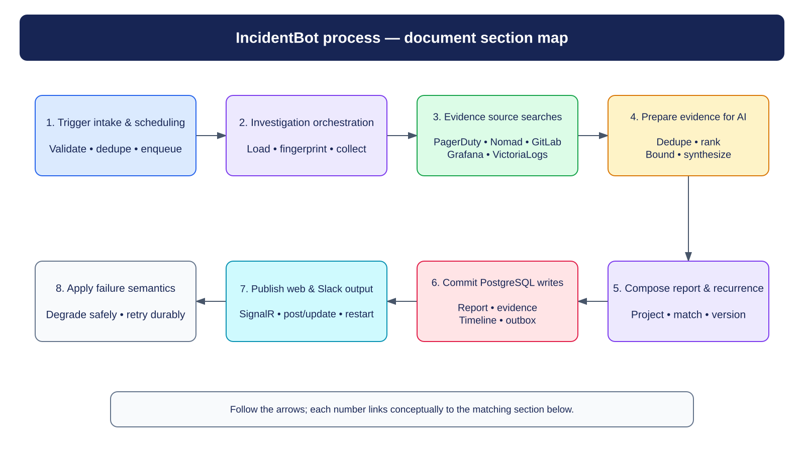
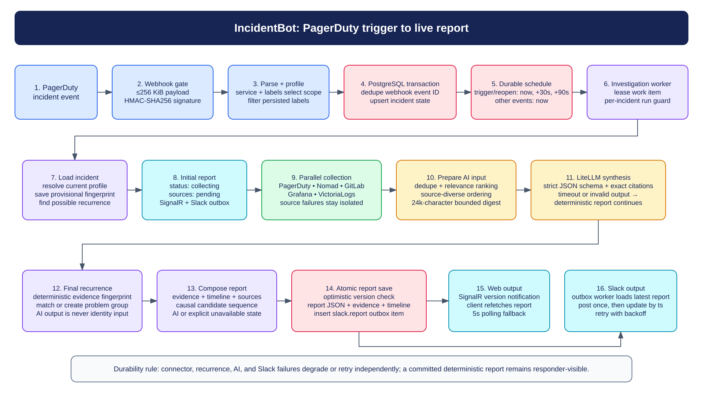
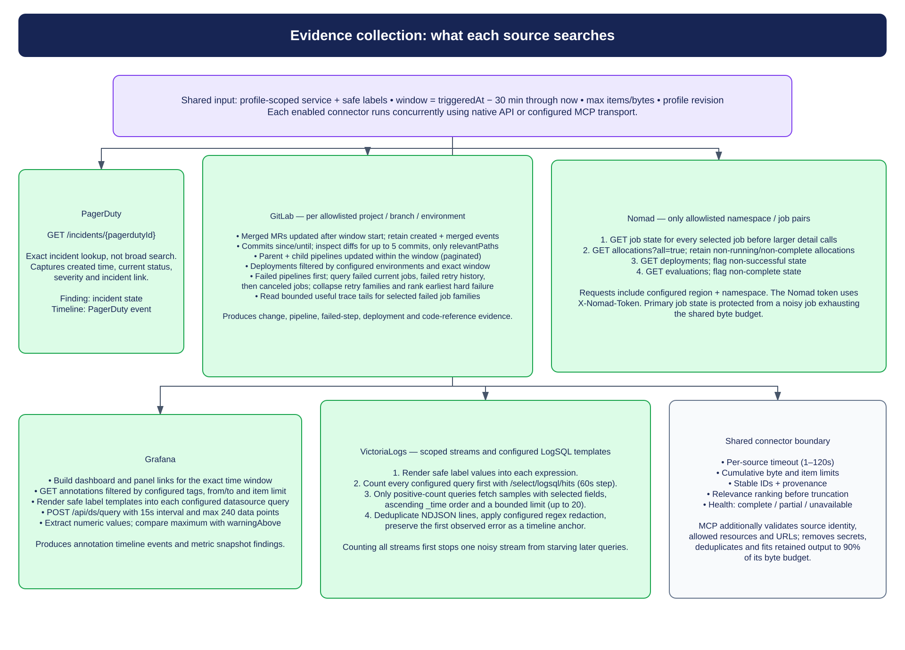
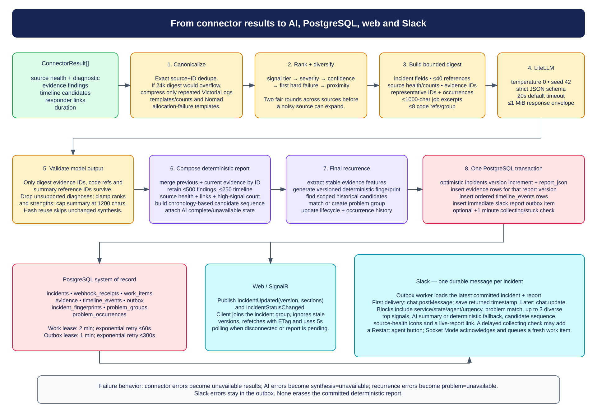

# IncidentBot incident investigation flow

This document describes the production path from an accepted PagerDuty event to the live web report, Slack message, and PostgreSQL records. It reflects the current implementation in `IncidentBot.Api`; demo mode is a separate staged-report adapter.

The concrete projects, jobs, dashboards, log queries, labels, and connector transports are supplied by the runtime investigation-profile YAML. That file is not present in this repository, so the source descriptions below document the search shape and enforcement boundaries rather than environment-specific targets.

## Section map



Editable source: [`incidentbot-numbered-process.excalidraw`](diagrams/incidentbot-numbered-process.excalidraw)

## Detailed end-to-end overview



Editable source: [`incidentbot-trigger-to-output.excalidraw`](diagrams/incidentbot-trigger-to-output.excalidraw)

The important durability boundary is the first PostgreSQL transaction. It records the webhook receipt, upserts the incident, and creates durable work before the endpoint returns `202 Accepted`. Everything after that can be retried or degraded independently.

## 1. Trigger intake and durable scheduling

PagerDuty sends `POST /api/webhooks/pagerduty/v3`.

1. The endpoint rejects a declared or streamed body larger than the configured maximum. The checked-in default is 256 KiB.
2. It verifies the `X-PagerDuty-Signature` as HMAC-SHA256 using a secret from the configured environment variable. The comparison is fixed-time.
3. It parses the event ID and type, incident ID, service ID, title, urgency, URL, occurrence time, alert-rule ID, and short string custom details.
4. The profile store selects an investigation profile by PagerDuty service ID, then by the most-specific matching alert-rule/label selector. It persists only standard or selector-used labels and rejects label names that look sensitive.
5. `AcceptWebhookAsync` starts a PostgreSQL transaction:
   - inserts `webhook_receipts(event_id, payload_hash, …)` with `ON CONFLICT DO NOTHING`;
   - treats an existing event ID as a duplicate and creates no new work;
   - upserts the `incidents` row by PagerDuty incident ID;
   - maps the PagerDuty event to responder state and freezes resolved incidents;
   - inserts idempotent `work_items`.
6. Triggered and reopened events schedule investigations for now, +30 seconds, and +90 seconds. Acknowledged, escalated, reassigned, resolved, and unknown events schedule one immediate pass.

Those repeated triggered/reopened passes intentionally sample a developing incident. Each report pass merges with retained evidence from the previous version, and unchanged evidence can reuse the previous successful AI synthesis by evidence hash.

The investigation worker leases due work for two minutes, increments its attempt count, and prevents two runs for the same incident from executing at once. Failed work is released with exponential retry capped at 60 seconds.

## 2. Investigation orchestration

For each leased work item, `InvestigationRunner`:

1. Loads the current incident and resolves the current profile.
2. Generates and persists a provisional deterministic fingerprint from the incident and safe labels, then looks for possible historical problem matches.
3. If the incident has no report version, saves an initial `collecting` report with pending source states. Saving that version also creates Slack outbox work, and SignalR tells connected clients to refetch it.
4. Sets the persisted investigation status to `collecting`.
5. Builds an `InvestigationContext` and `EvidenceScope`.
6. Selects only profile-enabled connectors and runs them concurrently with `Task.WhenAll`.
7. Converts a connector exception into an `unavailable` result without cancelling the other sources.
8. Sends the bounded connector results to synthesis, composes the deterministic report, resolves the final recurrence context, persists a new version, and publishes the version through SignalR.

With the checked-in defaults, evidence scope starts 30 minutes before `triggeredAt` and ends at collection time, with global ceilings of 250 items and 1 MiB. Each connector also applies the stricter of those limits and its profile-specific item/byte limits. Some APIs accept an exact time range; exact incident or current-workload lookups use the same context without pretending to be server-side time searches.

## 3. What each evidence source searches



Editable source: [`incidentbot-source-searches.excalidraw`](diagrams/incidentbot-source-searches.excalidraw)

| Source | Native API search | Evidence produced |
| --- | --- | --- |
| PagerDuty | Looks up exactly `GET /incidents/{pagerdutyIncidentId}`. It does not perform a broad incident search. | Current incident status, creation time, severity, incident link, and a PagerDuty timeline event. |
| Nomad | For each allowlisted namespace/job pair, reads the primary job state first, then allocations with `all=true`, deployments, and evaluations. Region and namespace are explicit. Allocations in `running` or `complete` state are omitted; unhealthy job/deployment/evaluation states become workload-failure findings. | Job state, unhealthy allocations, deployments/evaluations, workload timeline events, and job links. |
| GitLab | For each allowlisted project: merged MRs updated after the window start and filtered by merged time; branch commits since/until; diffs for up to five commits filtered to `relevantPaths`; parent and child pipelines updated in the window; configured-environment deployments; failed/cancelled pipeline jobs and bounded trace tails. | MR create/merge events, commits, allowlisted diffs and code references, pipelines, failed-step output, deployments, actors, links, and a candidate change/failure timeline. |
| Grafana | Builds dashboard/panel links for the window; fetches annotations by configured tags/from/to; renders safe label templates into configured datasource queries and posts them to `/api/ds/query` with 15-second intervals and at most 240 points. | Annotation events and metric snapshots. Numeric maxima over `warningAbove` become warning findings. |
| VictoriaLogs | Renders configured LogSQL templates and stream filters. It counts every query first with `/select/logsql/hits`; only positive counts fetch samples from `/select/logsql/query`, selecting configured fields, sorting by `_time` ascending, and limiting to at most 20. | Query counts, redacted log samples, and an independently citable first-error timeline anchor. |

### Native API and MCP use the same connector contract

Each profile source selects either `api` or `mcp` transport. Both return a `ConnectorResult` with:

- source health and a bounded diagnostic;
- bounded, source-attributed findings;
- timeline candidates;
- responder links;
- collection duration.

The native path uses cumulative byte accounting, item limits, bounded reads, per-source timeouts, stable IDs, and structured provenance. Exhausting a budget results in `partial` health where useful retained evidence exists.

The MCP boundary additionally treats the tool result as untrusted. It verifies that the returned source matches the requested source, rejects findings outside the requested time/resource scope, enforces source-specific allowlists, applies deny-by-default URL rules, removes credential material, canonicalizes IDs, deduplicates findings/timeline/links, and fits the normalized result to 90% of the retained byte budget.

## 4. Preparing evidence for AI



Editable source: [`incidentbot-ai-persistence-output.excalidraw`](diagrams/incidentbot-ai-persistence-output.excalidraw)

AI receives a purpose-built digest, never raw connector response bodies.

### Canonicalization and adaptive compression

The synthesizer first removes exact duplicates by `source + evidence ID`. It builds an exact digest and uses it if it fits the configured input-character budget, which is 24,000 characters by default.

Only when that exact digest is budget-constrained does it try semantic compression. The compressor deliberately has a narrow scope:

- repeated VictoriaLogs `log-sample` templates;
- equivalent VictoriaLogs query-count snapshots;
- repeated Nomad allocation failures with the same normalized failure template.

First-error anchors, GitLab failures, metrics, change evidence, code-bearing findings, and all other categories remain independently citable. A compressed group keeps its occurrence count, first/last time, all member IDs for audit, up to three representative findings, and up to eight code references.

### Deterministic ranking and source diversity

Evidence priority is separate from source severity. The score orders by:

1. category-specific signal tier;
2. severity;
3. confidence;
4. a bonus for the earliest hard GitLab failure;
5. proximity to the incident trigger.

Synthesis ordering then gives every operational source two fair rounds before adding the remaining ranked findings. This prevents a high-volume source from consuming the entire digest ahead of independent corroboration.

### Digest contents

The bounded digest contains, in order:

- incident title, service, state, urgency, and trigger time;
- up to 40 exact summary-reference IDs;
- source health, finding counts, and semantic-group counts;
- ranked evidence lines with exact evidence IDs, source, time, severity/category, actor, and bounded summary;
- occurrence counts and representative evidence IDs for compressed groups;
- up to 1,000 characters of selected pipeline-job output excerpts;
- immutable code-reference IDs, project/path/line range/commit, and excerpts, bounded to eight per group.

All digest text is labelled as untrusted data. Newlines in individual fields are flattened and each field has its own length cap.

The digest is SHA-256 hashed. A previous `complete` synthesis with the same hash and summary parts is reused.

### LiteLLM request and response enforcement

The request uses temperature `0`, seed `42`, the configured model, a default 20-second timeout, and a strict JSON-schema response format. The schema allows:

- ordered `summaryParts`, each optionally linked to an available reference ID;
- up to five possible contributors;
- up to five unknowns;
- up to five recommended checks;
- up to five ranked diagnoses with evidence strength and bounded evidence/code-reference ID lists.

The response envelope is streamed under a 1 MiB limit. After JSON parsing, IncidentBot removes unknown summary references, unknown evidence IDs, and unknown code-reference IDs. Diagnoses with no surviving support are discarded, ranks and strengths are clamped, and the summary is capped at 1,200 characters.

A timeout, HTTP failure, invalid envelope, invalid schema, or other synthesis error returns `AiSynthesis(status: "unavailable")`. The deterministic report still completes.

## 5. Report composition and recurrence

`ReportComposer` merges previous and new findings by ID, preferring the latest value. It then:

- keeps a source-diverse high-priority head and retains at most 500 evidence findings;
- deduplicates timeline candidates and retains at most 250, reserving space for newest, high-severity, and trigger-proximate events;
- records every connector's health, duration, diagnostic, finding count, and links;
- deduplicates links by URL and retains at most 100;
- computes a deterministic high-signal summary;
- projects a chronology-ordered *candidate sequence* from MRs, pipeline failures, failed jobs, deployments, Nomad failures, and first log errors. Chronology is not asserted as causation.

After composition, recurrence generates the authoritative final deterministic fingerprint from stable incident and evidence features. It saves the fingerprint, finds candidates in the same algorithm/service/profile scope, and transactionally matches or creates a problem group and updates occurrence history/lifecycle. AI output is not used for fingerprint identity, problem association, or lifecycle.

## 6. PostgreSQL writes

`SaveReportAsync` commits one report version and its publication intent together:

1. Updates `incidents.report_json`, `version`, `status`, and `updated_at` only if the caller's expected version still matches.
2. Inserts the retained evidence rows for that report version.
3. Inserts ordered timeline rows for that report version.
4. Inserts an immediate `slack.report` outbox item.
5. If the saved report is still `collecting`, inserts a second outbox item due in one minute so Slack can surface a stuck/restart state if the version is still current.

| Table | Role |
| --- | --- |
| `webhook_receipts` | Event-ID idempotency and raw-payload hash audit. |
| `incidents` | Current incident state, investigation status, report JSON/version, Slack destination/timestamp, safe labels. |
| `work_items` | Durable investigation schedule, leases, attempts, errors, completion. |
| `evidence` | Versioned retained findings. |
| `timeline_events` | Versioned ordered timeline projection. |
| `outbox` | At-least-once Slack publication work. |
| `incident_fingerprints` | Provisional/final deterministic features and hashes by algorithm version. |
| `problem_groups` | Recurring problem identity, lifecycle, representative fingerprint, and aggregate dates/counts. |
| `problem_occurrences` | Incident-to-problem association, match score/type, explanation, and active state. |

An optimistic version conflict fails the work item so the durable queue retries from current state instead of overwriting a newer report.

## 7. Web and Slack output

### Live web report

After a successful save, SignalR publishes `IncidentUpdated(incidentId, version, changedSections)` and `IncidentStatusChanged`. The React client joins the incident group and refetches the report. It ignores stale versions, uses `If-None-Match` for conditional reads, reconnects automatically, and polls every five seconds while disconnected or before a report is available.

### Slack

Slack delivery is conditional on `Slack.Enabled`; it is disabled in the checked-in default configuration.

The outbox worker leases `slack.report` items for one minute. A failure releases the item with exponential retry capped at 300 seconds. The publisher always loads the latest committed incident and report before rendering:

- first delivery calls `chat.postMessage` and stores the returned timestamp;
- later deliveries call `chat.update`, keeping one message per incident;
- blocks contain service, incident state, investigation status, urgency, update time, recurrence context, up to three diverse top signals, the AI summary or deterministic fallback, candidate sequence, source-health icons, and an `Open live investigation` button;
- a collecting report that remains current for at least one minute may include `Restart agent`.

Slack Socket Mode acknowledges interactive envelopes immediately. A valid restart action retires unfinished work for the incident, sets status back to `queued`, inserts a new immediate work item and a delayed Slack check, cancels an in-flight run when present, and refreshes the message.

## 8. Failure semantics

| Failure | Result |
| --- | --- |
| One connector times out or throws | That source is `unavailable`; other connectors and report composition continue. |
| Connector exhausts a byte/item budget | Useful retained evidence is returned with `partial` health and a bounded diagnostic. |
| All selected connectors are unavailable | The deterministic report completes with `degraded` status unless the incident is frozen/resolved. |
| LiteLLM fails or returns unsupported citations | AI is `unavailable` or repaired; deterministic evidence, summary, persistence, recurrence, web, and Slack fallback remain available. |
| Recurrence fails | Report records problem matching as unavailable with a bounded diagnostic; the main report still saves. |
| Report save races a newer version | Work item fails and retries; stale content does not overwrite the newer version. |
| Slack fails | Committed report is unaffected; outbox retries delivery. |
| Resolved incident | Incident is frozen; final report status is `resolved`, while durable finalization can finish. |

## Implementation map

| Concern | Primary implementation |
| --- | --- |
| Webhook validation and parsing | `IncidentBot.Api/Incidents/PagerDutyWebhookEndpoints.cs`, `IncidentBot.Api/Security/PagerDutySignatureValidator.cs` |
| Profile selection and safe labels | `IncidentBot.Api/Profiles/InvestigationProfileStore.cs`, `IncidentBot.Api/Profiles/ProfileModels.cs` |
| Intake persistence and scheduling | `IncidentBot.Api/Infrastructure/IncidentRepository.cs` |
| Durable leasing and retry | `IncidentBot.Api/Infrastructure/DurableQueueRepository.cs`, `IncidentBot.Api/Incidents/DurableWorker.cs` |
| Investigation orchestration | `IncidentBot.Api/Incidents/InvestigationRunner.cs`, `IncidentBot.Api/Incidents/InvestigationWorker.cs` |
| Source selection and connectors | `IncidentBot.Api/Connectors/EvidenceSourceRegistry.cs`, `IncidentBot.Api/Connectors/*EvidenceConnector.cs` |
| MCP normalization boundary | `IncidentBot.Api/Connectors/McpConnectorResultBoundary.cs` |
| Evidence priority | `IncidentBot.Api/Incidents/EvidenceRankingPolicy.cs` |
| AI digest and response validation | `IncidentBot.Api/Incidents/LiteLlmSynthesizer.cs`, `IncidentBot.Api/Incidents/Compression/SemanticEvidenceCompressor.cs` |
| Deterministic report projection | `IncidentBot.Api/Incidents/ReportComposer.cs` |
| Fingerprinting and recurrence | `IncidentBot.Api/Fingerprinting/*` |
| Database schema | `IncidentBot.Api/Infrastructure/DatabaseInitializer.cs` |
| SignalR output | `IncidentBot.Api/Incidents/SignalRIncidentUpdatePublisher.cs`, `IncidentBot.Client/src/features/incidents/useIncidentSession.ts` |
| Slack rendering and restart | `IncidentBot.Api/Incidents/SlackPublisher.cs`, `IncidentBot.Api/Incidents/OutboxWorker.cs`, `IncidentBot.Api/Incidents/SlackSocketModeWorker.cs` |

## Diagram maintenance

The `.excalidraw` files are the editable sources. Every visible text element is bound to its container shape (`containerId` plus the shape's `boundElements` entry); there are no floating text boxes placed over shapes.

Run the generator after editing its definitions:

```bash
rtk node docs/diagrams/generate-incident-flow-diagrams.mjs
```

It validates the no-floating-text invariant and regenerates both the Excalidraw scenes and SVG previews used by this document.
